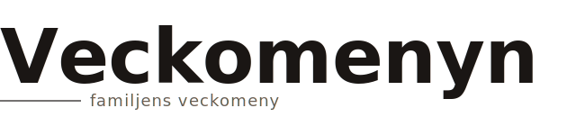
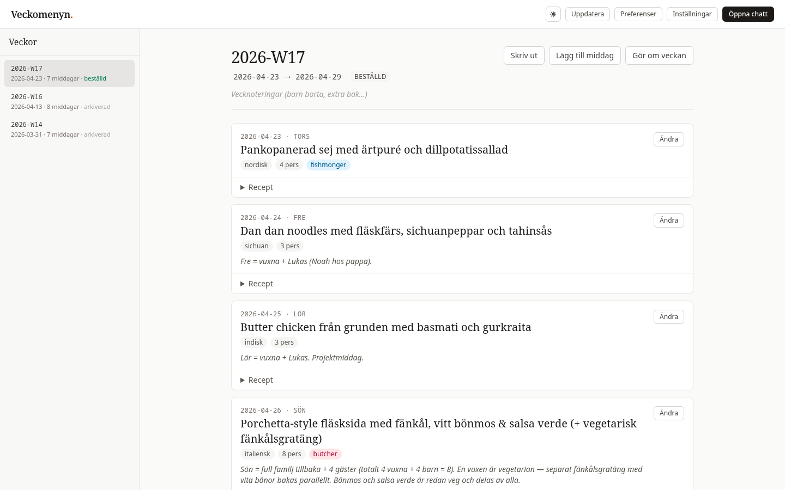
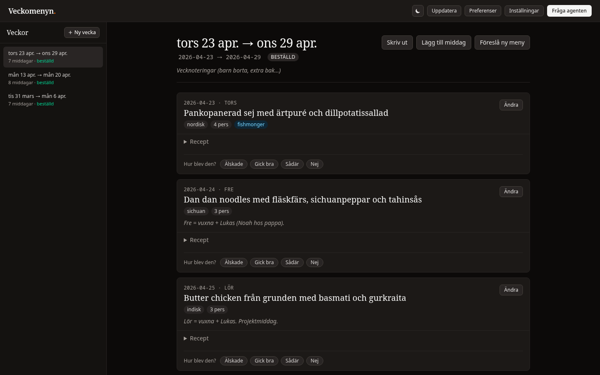
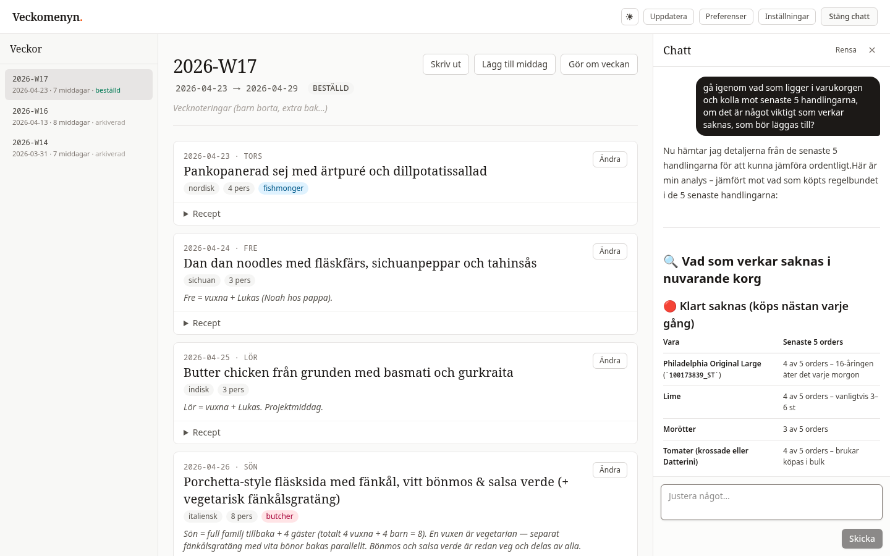
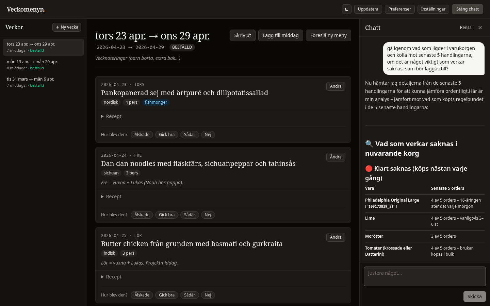
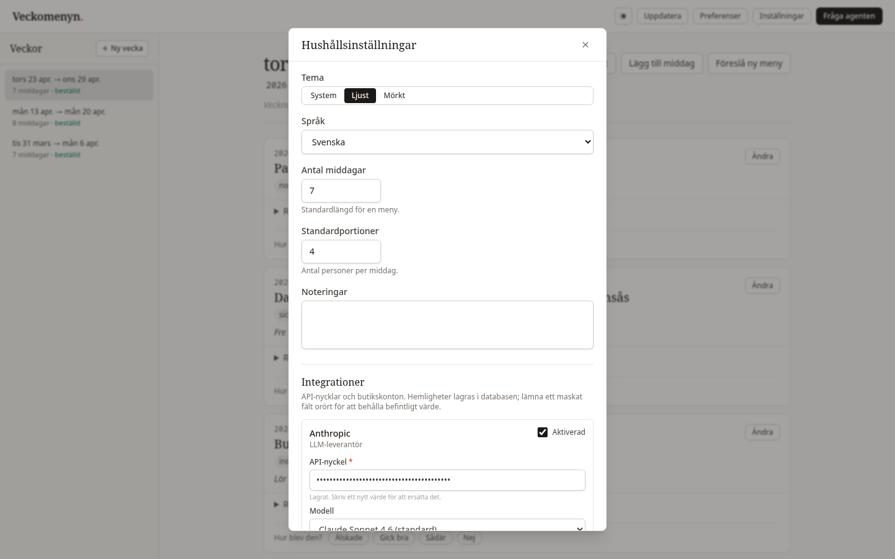
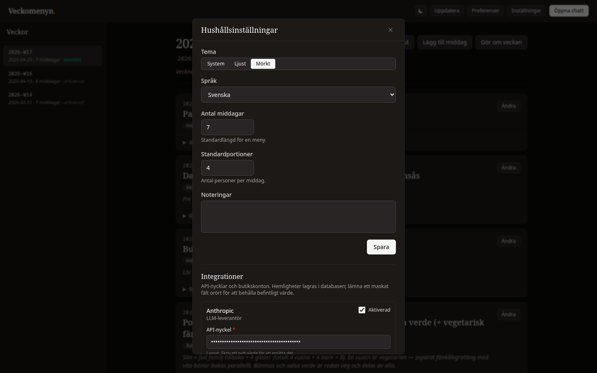
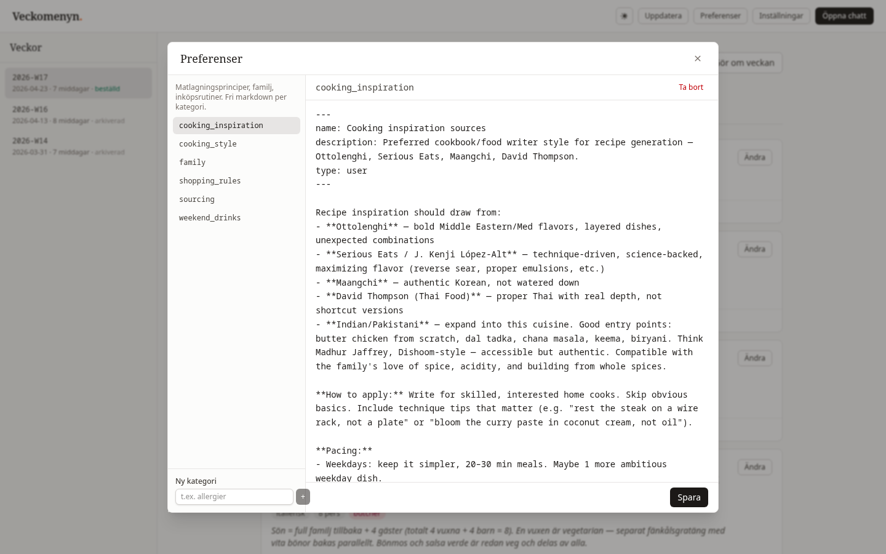
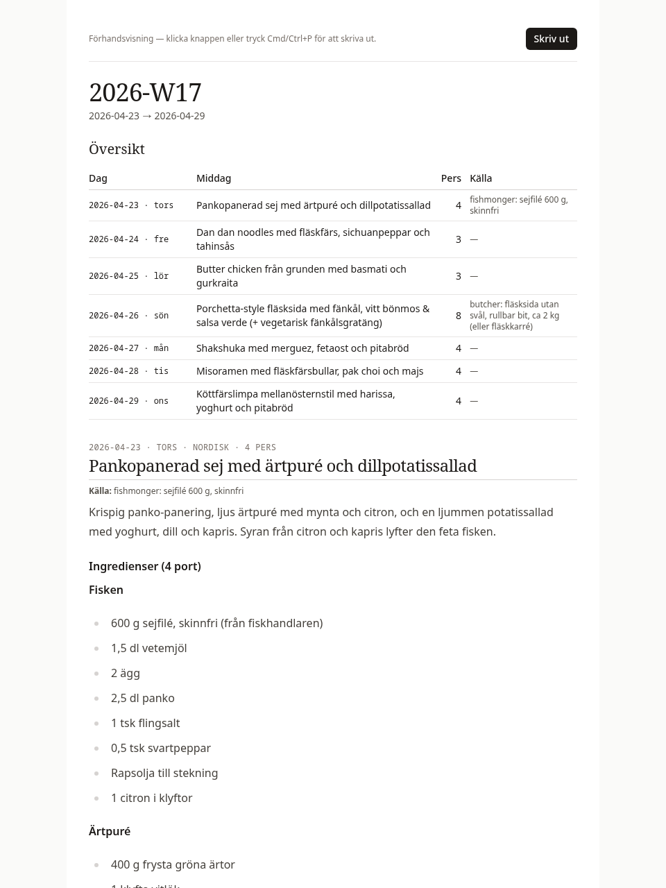

<p align="center">
  
</p>

<p align="center"><em>Familjens veckomeny, planerad och handlad.</em></p>

---

A Claude agent plans your family's week of dinners and builds the grocery cart. Self-hosted. It learns what's in the fridge, which kid won't eat cilantro, which store brands you trust.

Shopping backends are pluggable. Willys.se ships today.

## The loop

1. Set household constraints. Dinners per week, servings, allergies, what's usually in the pantry.
2. Ask the agent to plan a week. Swap dishes, regenerate, nudge until it looks right.
3. Let the agent build the grocery cart. It aggregates ingredients across all dinners, picks one product per ingredient, verifies.
4. Place the order in the store's own UI. Veckomenyn stops at cart-ready. Delivery and payment stay where they belong.
5. After the week, record a retrospective. That feedback shapes next week.



## Run it

```sh
cp .env.example .env
echo "MASTER_KEY=$(openssl rand -base64 32)" >> .env
docker compose up -d
open http://localhost:8080
```

`podman-compose up -d` works too. The compose file is plain OCI.

Open Settings. Add an Anthropic API key and store credentials. Both encrypt at rest with AES-256-GCM when `MASTER_KEY` is set, and the API masks them with a per-process sentinel on read.

Seed starter preferences (optional):

```sh
docker compose exec app veckomenyn-import --from /usr/local/share/veckomenyn/preferences
```

Any directory of `.md` files works. One file per category.

## Screenshots

| Week view (light) | Week view (dark) |
|---|---|
|  |  |
| **Chat drawer.** The agent narrates what it's doing. | **Chat** (dark). |
|  |  |
| **Settings.** Household defaults and integrations. | **Settings** (dark). |
|  |  |
| **Preferences.** Free-form markdown per category. | **Print preview.** Paper stays light whatever the theme. |
|  |  |

## Layout

```
cmd/
  veckomenyn/              HTTP server + embedded SPA. Main binary.
  veckomenyn-import/       Seeds preference files.
  veckomenyn-import-week/  Imports a historical week from markdown + CSV.
internal/
  agent/            Claude agent. System prompt, tools, streaming loop.
  willys/           Willys.se HTTP client.
  shopping/         Store-agnostic Provider interface. Willys adapter.
  providers/        Registry for LLM and shopping backends. AES-GCM at rest.
  server/           chi router, SSE chat, handlers.
  store/            pgxpool + goose migration runner.
  migrations/       Embedded SQL migrations.
web/                React 19, TypeScript, Tailwind v4, Biome, Vite.
shared-data/        Template preferences shipped for new installs.
```

The Go binary embeds the Vite bundle via `//go:embed`.

## Development

```sh
docker compose up -d db   # Postgres only
make dev                  # server + frontend with HMR
make test                 # go test -race + frontend typecheck
make lint                 # golangci-lint + biome
```

## Configuration

| Var | Purpose |
|---|---|
| `MASTER_KEY` | 32-byte base64 AES key. Encrypts provider secrets in the DB. Generate with `openssl rand -base64 32`. Without it, secrets live in cleartext and the server logs a warning at boot. |
| `DATABASE_URL` | Postgres DSN. Set automatically by compose. |
| `HTTP_ADDR` | Listen address. Defaults to `:8080`. |
| `HOST_PORT` | Host port mapped to the container's 8080. Defaults to 8080. |

Everything else, including the Anthropic model, lives in Settings.

## Backups

The compose stack runs a sidecar that dumps Postgres nightly to `./backups/` on the host. Retention: 14 daily, 8 weekly, 6 monthly. Dumps use `--clean --if-exists --no-owner --no-privileges`, so restoring into a fresh database is one command:

```sh
gzip -dc backups/daily/veckomenyn-YYYY-MM-DD.sql.gz \
  | docker compose exec -T db psql -U veckomenyn -d veckomenyn
```

Override `SCHEDULE` or `BACKUP_KEEP_*` in `docker-compose.yml` to change retention. The sidecar is [prodrigestivill/postgres-backup-local](https://github.com/prodrigestivill/docker-postgres-backup-local).

## Threat model

Single-household LAN deployment. No user accounts, no auth. The network boundary (Tailscale, home VPN, firewall) is what restricts access. Exposing it to the public internet without auth in front is outside scope.

## Contributing

[CONTRIBUTING.md](CONTRIBUTING.md) for PRs. [SECURITY.md](SECURITY.md) for vulnerabilities.

## License

MIT.
